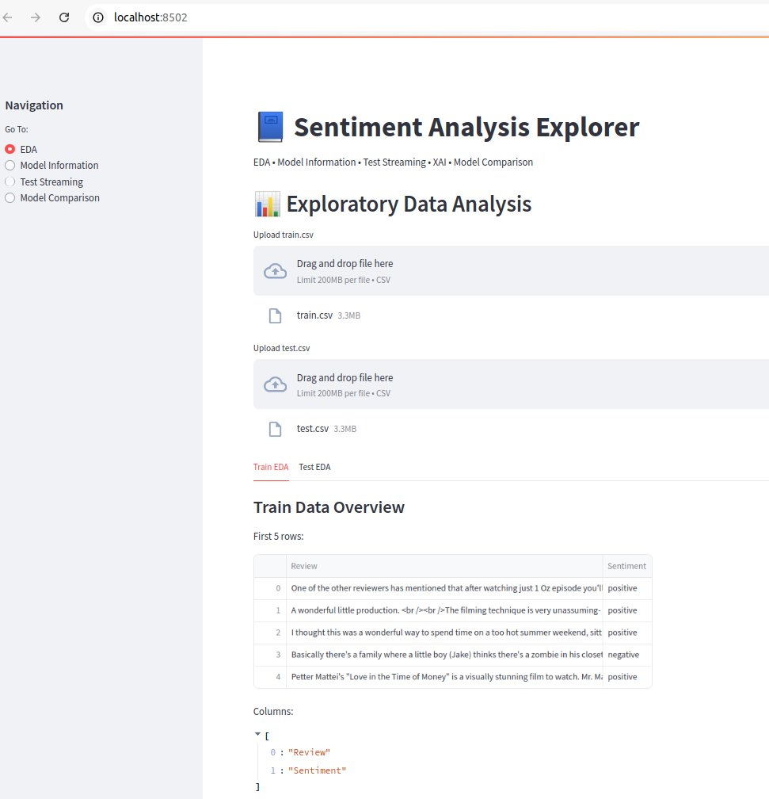
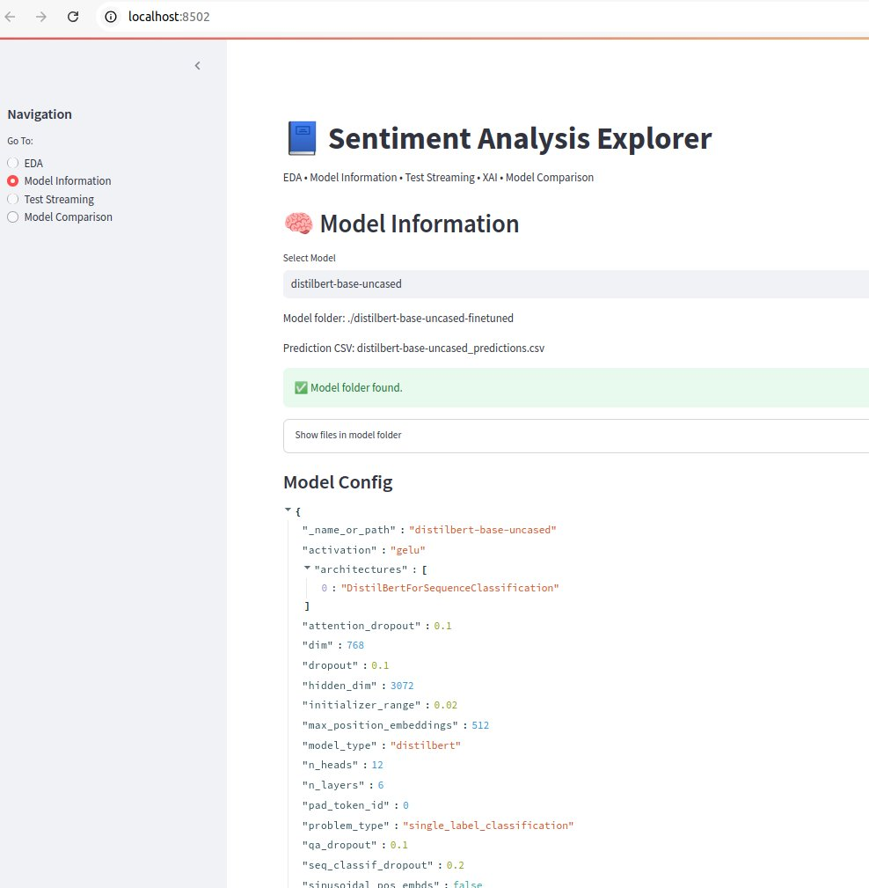
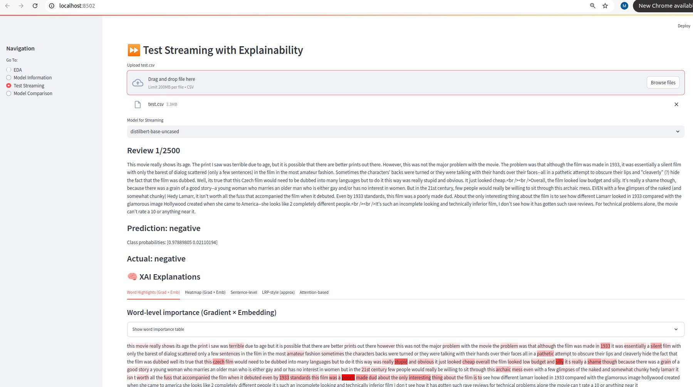

 # 🚀 LLM-Powered Sentiment Intelligence Platform

An **end-to-end NLP and LLM-style sentiment analysis system** built with **Transformer architectures** (BERT, DistilBERT, RoBERTa, XLNet).  
This project combines **modern language models**, **interactive analytics**, and **explainable AI (XAI)** into a **production-ready Streamlit application**.

Designed for **research, applied ML, and industry-facing demos**.

---

## 🔑 Highlights 
- 🧠 **LLM-style Transformers** for sentiment understanding
- 📊 **Interactive analytics dashboard**
- 🔍 **Explainable AI (XAI)** for model transparency
- ⚡ **Real-time inference & test streaming**
- 📈 **Model benchmarking & comparison**
- 🧪 **Research-grade evaluation metrics**
- 🧩 Modular, extensible, and production-oriented codebase

---

# 📸 Application Screenshots

<p align="center">
  
</p>

<p align="center">
  
</p>

<p align="center">
  
</p>


## 🤖 LLM & Transformer Stack

This platform supports multiple **state-of-the-art Transformer models**:

- **BERT** – contextual language understanding
- **DistilBERT** – lightweight LLM-style inference
- **RoBERTa** – robust optimized transformer
- **XLNet** – autoregressive language modeling

All models are fine-tuned for **binary sentiment classification (positive / negative)** using **Hugging Face Transformers**.

---

## 🗂️ System Architecture
Text Data (CSV)
↓
Text Cleaning & Tokenization
↓
Transformer Models (LLMs)
↓
Predictions & Probabilities
↓
Explainable AI (XAI)
↓
Streamlit Analytics Dashboard


---

## 📁 Repository Structure


.
├── Sentiment.py # Streamlit LLM dashboard (EDA, inference, XAI)
├── train_Xformers.py # Batch inference & evaluation pipeline
├── dataset/
│ ├── train.csv
│ └── test.csv
├── *-finetuned/ # Fine-tuned Transformer models
├── *_predictions.csv # Model prediction outputs
└── README.md


---

## 📊 Capabilities

### 🔍 Exploratory Data Analysis (EDA)
- Dataset inspection
- Sentiment distribution
- Missing value analysis

### 🧪 Model Evaluation
- Accuracy, Precision, Recall, F1-score
- Confusion matrices
- Test-set benchmarking

### 🧠 Explainable AI (XAI)
- Gradient × Embedding explanations
- Approximate LRP-style relevance
- Attention-based token importance
- Sentence-level relevance scoring
- Visual heatmaps and token highlighting

### ⏩ Real-Time Test Streaming
- Step-by-step inference on test samples
- Live probability tracking
- Model behavior inspection

---

## 📁 Dataset Format

CSV files must contain:

- **Review** – input text
- **Sentiment** – ground truth (`positive` / `negative`)

```csv
Review,Sentiment
"Great experience and service",positive
"Terrible quality and support",negative

🛠️ Installation
pip install streamlit torch transformers pandas numpy matplotlib seaborn scikit-learn


✔ Compatible with Python 3.8+

▶️ Run the LLM Dashboard
streamlit run Sentiment.py


This launches a full-stack LLM analytics interface in your browser.

🧪 Batch Inference & Evaluation
python train_Xformers.py


Generates model-specific prediction files for benchmarking and comparison.

📈 Model Benchmarking

The platform compares models across:

Accuracy

Precision / Recall / F1

Class-wise performance

Exportable evaluation metrics

Designed for model selection and research benchmarking.

🎯 Ideal For

AI / ML Engineer portfolios

NLP & LLM research projects

Explainable AI (XAI) demonstrations

Sentiment intelligence systems

Recruiter-facing technical showcases
